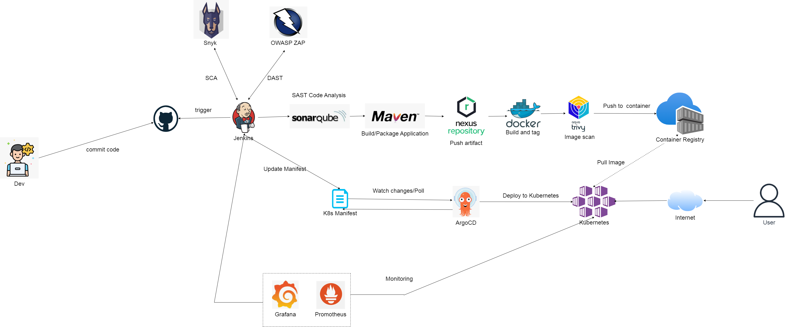

# Building and Securing CI/CD Pipelines: Applying DevSecOps for End-to-End Application Deployment

Welcome to the **CI/CD Pipeline Integration and Security** project! This project applies various popular tools to ensure that the Continuous Integration and Continuous Deployment (CI/CD) processes are automated, efficient, and secure.

## Contributor
- **Ngô Minh Thiên** - 21522623  
- **Nguyễn Đình Bảo Long** - 21522303  

## Workflow CI/CD Pipeline

The project is divided into **3 phases**:

### CI Phase:
- **Push source code** to GitHub.
- **Jenkins Trigger Code** from the GitHub repository and perform tasks.
- **Perform SAST scan** using **SonarQube**.
- **Perform SCA scan** using **Snyk**.
- **Set up OWASP Zap** to perform scans after deployment.
- **Compile, Test, Build, and Deploy** using **Maven**.
- **Store artifacts** using **Nexus Repository**.
- **Build and tag images** using **Docker**.
- **Scan images** using **Trivy**.
- **Store images** in **Azure Container Registry**.

### CD Phase:
- **Write YAML files** (Ingress, Service, Deployment) for deploying to the Kubernetes cluster.
- **Utilize Azure Kubernetes Service**.
- **Implement GitOps** with **ArgoCD**.

### Monitoring Phase:
- **Monitor** using **Prometheus** and **Grafana** (for Jenkins server and Kubernetes Environment).
## Tools Used
In this project, we applied various popular tools to ensure the CI/CD processes are automated, efficient, and secure. The tools include:

| **Tool**                     | **Function**                                                                  |
|------------------------------|-------------------------------------------------------------------------------|
| **GitHub**                   | Manages source code and triggers the pipeline on changes.                     |
| **Jenkins**                  | CI tool responsible for integration, testing, and deployment.                 |
| **SonarQube**                | Performs static application security testing (SAST).                          |
| **Snyk**                     | Scans for vulnerabilities in third-party components (SCA).                    |
| **Maven**                    | Manages projects, compiles, tests, and builds applications.                   |
| **Nexus Repository**         | Stores artifacts after the build process.                                     |
| **Docker**                   | Creates and manages Docker images for application deployment.                  |
| **OWASP Zap**                | A tool for dynamic application security testing (DAST).                       |
| **Trivy**                    | Scans for security vulnerabilities in Docker images.                          |
| **Azure Container Registry**  | Stores Docker images.                                                         |
| **Kubernetes (K8s)**         | Manages and deploys application containers.                                   |
| **Argo CD**                  | Implements GitOps for Continuous Deployment, automating application updates on Kubernetes. |
| **Prometheus & Grafana**     | Monitors system performance and sets up alerts.                               |

---
